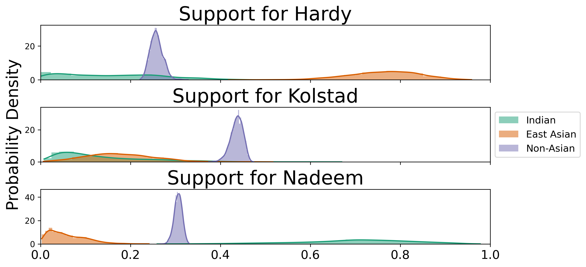
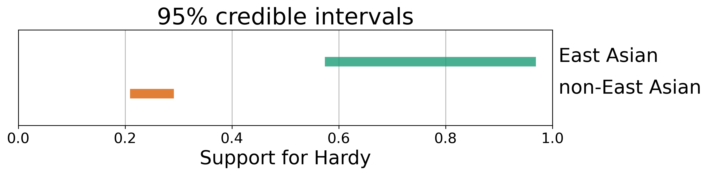
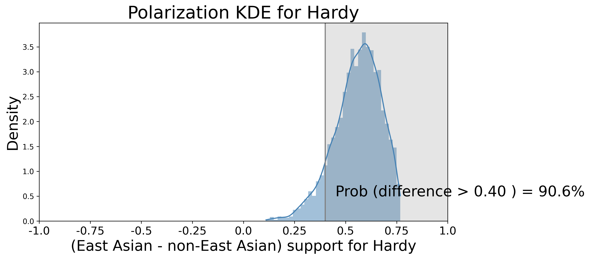
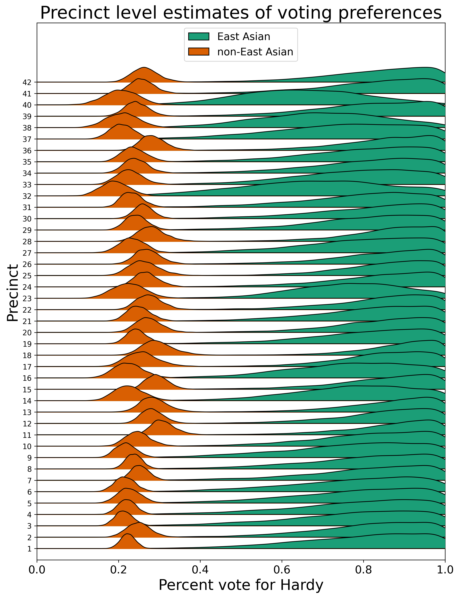
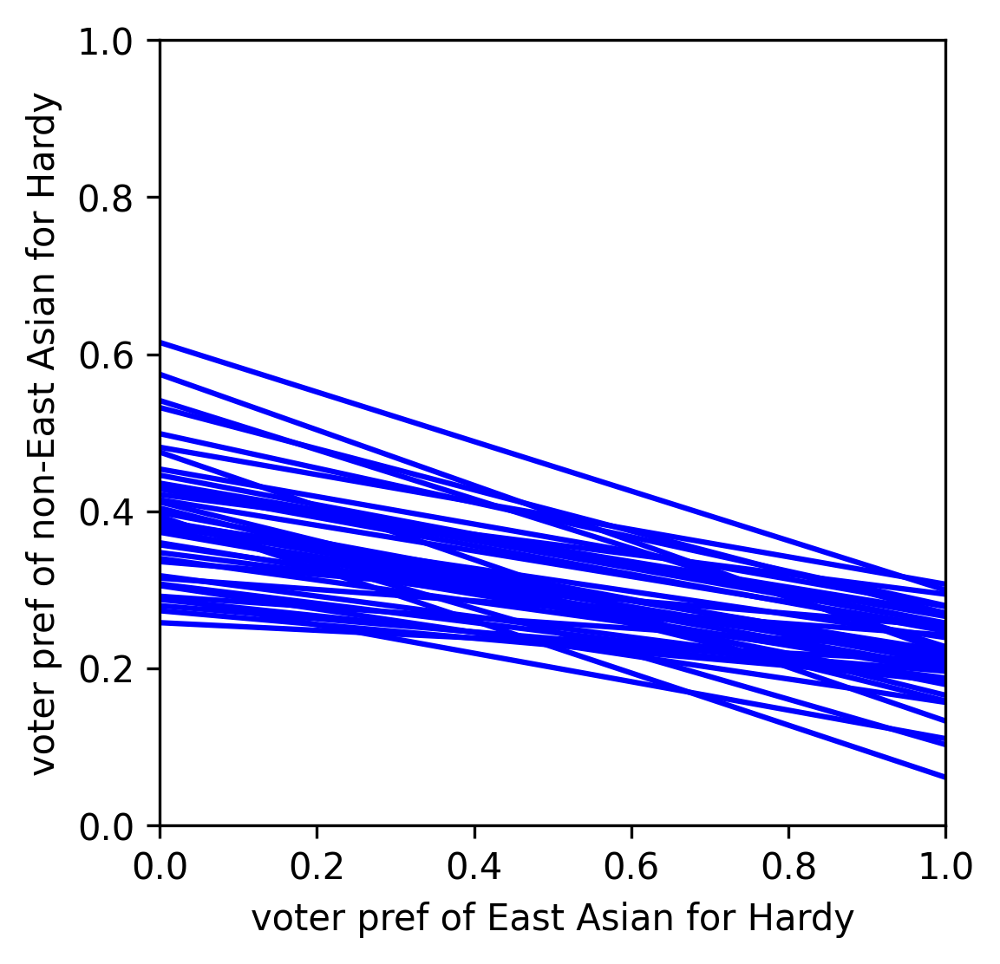

# Summary

An important question in some voting rights and redistricting litigation in the U.S. is whether and to what degree voting is racially polarized.
In the setting of voting rights cases, there is a family of methods called "ecological inference" (see especially [@king1997solution]) that uses
observed data, pairing voting outcomes with demographic information
for each precinct in a given polity, to infer voting patterns for each demographic group.

More generally, we can think of ecological inference as seeking to use knowledge about the margins of a set of tables (\autoref{fig:table_ex}) to infer associations between the row and column variables, by making (typically probabilistic) assumptions. In the context of assessing racially polarized voting, a table like the one in \autoref{fig:table_ex} will correspond to a precinct, where each column corresponds to a candidate or voting outcome and each row to a racial group. Ecological inference methods then use the vote counts and demographic data for each precinct to make inferences about the overall voting preferences by demographic group, thus addressing questions like: "What percentage of East Asian voters voted for Hardy?". This example is an instance of what is referred to in the literature as "R by C" ecological inference, where here we have R $=$ 2 groups and C $=$ 3 voting outcomes.
`PyEI` was created to support performing ecological inference with voting data; however, ecological inference methods also applicable in other fields, such as epidemiology [@elliot2000spatial] and sociology [@goodman1953ecological].

{ width=70% }

# Statement of need

The results of ecological inference for inferring racially polarized voting are routinely used in
US voting rights cases [@king1997solution]; therefore, easy to use and high quality tools for performing ecological inference are of practical interest. There is a need for an ecological inference library that 
brings together a variety of ecological inference methods in one place to facilitate
crucial tasks such as: quantifying the uncertainty associated with ecological inference
results under a given model; making comparisons between methods; and bringing relevant 
diagnostic tools to bear on ecological inference methods. To address this need, 
we introduce `PyEI`, a Python package for ecological inference. 

`PyEI` is meant to be useful to two main groups of researchers. First, it serves application-oriented researchers and practitioners who seek to run ecological inference on domain data (e.g., voting data), report the results, and understand the uncertainty related to those results.
Second, it facilitates exploration and benchmarking for researchers who are seeking to understand properties of existing
ecological inference methods in different settings and/or develop new statistical methods for ecological inference.

`PyEI` brings together the following ecological inference methods in a common framework alongside plotting, reporting, and diagnostic tools:

- Goodman's ecological regression [@goodman1953ecological] and a Bayesian linear regression variant
- A truncated-normal based approach [@king1997solution]
- Binomial-Beta hierarchical models [@king1999binomial]
- Dirichlet-Multinomial hierarchical models [@rosen2001bayesian]
- A Bayesian hierarchical method for ${2 \times 2}$ EI following the approach of @wakefield2004ecological

(In several of these cases, `PyEI` includes modifications to the models as originally proposed in the cited literature, such as reparametrizations or other changes to upper levels of the hierarchical models in order to ease sampling difficulties.)

`PyEI` is intended to be easily extensible, so that additional methods from the literature can continue to be incorporated (for example, work is underway to add the method of @greiner2009r, currently implemented in the R package `RxCEcolInf` [@RxCEcolInf]). Newly developed statistical methods for ecological inference can be included and conveniently compared with existing methods.

Several R libraries implementing different ecological inference methods exist, such as `eiPack` [@eiPack], `RxCEcolInf` [@RxCEcolInf], `ei` [@ei], and `eiCompare` [@eiCompare]. In addition to presenting a Python-based option that researchers who primarily use Python may appreciate, `PyEI` 
incorporates the following key features and characteristics.

First, the Bayesian hierarchical methods implemented in `PyEI` rest on modern probabilistic programming tooling [@salvatier2016probabilistic] and gradient-based MCMC methods such as the No U-Turn Sampler (NUTS) [@hoffman2014no]. Using NUTS where possible should allow for faster convergence than existing implementations that rest primarily on Metropolis-Hastings and Gibbs sampling steps. Consider effective sample size, which is a measure of how the variance of the mean of drawn samples compare to the variance of i.i.d. samples from the posterior distribution (or, very roughly, how “effective” the samples are for computing the posterior mean, compared to i.i.d. samples) [@BDA3]. In Metropolis-Hastings, the number of evaluations of the log-posterior required for a given effective sample size scales linearly with the dimensionality of the parameter space, while in Hamiltonian Monte Carlo approaches such as NUTS, the number of required evaluations of the gradient of the log-posterior scales only as the fourth root of the dimension [@neal2011mcmc]. Reasonable scaling with the dimensionality of the parameter space is important in ecological inference, as that dimensionality is large when there are many precincts.

Second, integration with the existing tools `PyMC3` [@salvatier2016probabilistic] and `ArviZ` [@arviz_2019] makes the results amenable to state of the art diagnostics (e.g. convergence diagnostics) and some reasonable checks are automatically performed. 
 
Third, summary and plotting utilities for reporting, visualizing, and comparing results are included (see example plots below), with an emphasis on visualizations and reports that clarify the uncertainty of estimates under a model.

Lastly, clear documentation is provided, including a set of introductory and example notebooks.

# Acknowledgments

This software development is part of a research project comparing methods, joint with Moon Duchin and Thomas Weighill. We thank Colin Carroll, JN Matthews, and Matthew Sun for their helpful contributions to `PyEI`. 

\newpage
# Examples of plotting functionality

{ width=100% } 

{ width=100% }

{ width=100% }

{ width=50% }

{ width=40% }

\newpage

# References

