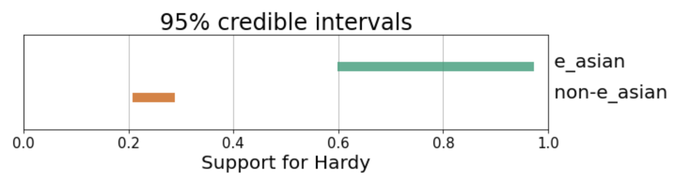

# Summary

An important question in some US voting rights cases and
redistricting litigation is whether and to what degree voting is racially polarized.
In the setting of voting rights cases, ecological inference involves using
observed data about voting outcomes in each of a number of precincts and demographic information
about each precinct to infer voting patterns within each demographic group.

More generally, we can think of ecological inference as seeking to use knowledge about the margins of a set of tables (\autoref{fig:table_ex}) to infer associations between the row and column variables, by making (typically probablistic) assumptions about the underlying associations. In the context of assessing racially polarized voting, each column in a table like the one in \autoref{fig:table_ex} corresponds to a candidate or voting outcome, each row to a racial group, and each table to a precinct. Ecological inference methods then use the known counts of voting outcomes in each precinct and the known counts of people in demographic groups in each precinct to make inferences about the distribution of voting outcomes within each demographic group, thus addressing questions like: "What percentage of voters in Group 1 voted for Candidate A?"). The "two by two" ecological inference problem in this example, where we have two groups and two voting outcomes, is a special case of the more general "R by C" ecological inference, in which we may have more than two groups or voting outcomes.
Ecological inference is also applicable in other fields, such as epidemiology and sociology.

{ width=70% }

# Statement of need

The results of ecological inference for inferring racially polarized voting are used in
US voting rights cases; therefore, easy to use and high quality tools for performing ecological inference are of practical interest. There is a need for an ecological inference library that 
brings together a variety of ecological inference methods in one place and makes easy
crucial tasks such as: quantifying the uncertainty associated with ecological inference
results under a given model; making comparisons between methods; and bringing relevant 
diagnostic tools to bear on ecological inference methods. To address this need, 
we introduce `PyEI`, a Python package for ecological inference. 

`PyEI` is meant to be useful to two main groups of researchers. First, it serves application-oriented researchers and practitioners who seek to run ecological inference on domain data (e.g. voting data), report results, and understand the uncertainty related to those results.
Second, it facilitates exploration and benchmarking for researchers who are seeking to understand properties of existing
ecological inference methods in different settings and/or develop new statistical methods for ecological inference.

`PyEI` brings together the following ecological inference methods in a common framework alongside plotting, reporting, and diagnostic tools:

- Goodman's ecological regression [@goodman1953ecological] and a Bayesian linear regression variant
- A truncated-normal based approach [@king1997solution]
- Binomial-Beta hierarchical models [@king1999binomial]
- Dirichlet-Multinomial hierarchical models [@rosen2001bayesian]
- A Bayesian hierarchical method for 2x2 EI following the approach of @wakefield2004ecological

(In several of these cases, `PyEI` includes modifications to the models as originally proposed in the cited literature, such as reparametrizations or other changes to upper levels of the hierarchical models in order to ease sampling difficulties.)

`PyEI` is intended to be easily extensible, so that additional methods from the literature can continue to be incorporated (for example, work is underway to add the method of @greiner2009r, currently implemented in the R package `RxCEcolInf` [@RxCEcolInf]), and so that newly developed statistical methods for ecological inference can be included and conveniently compared with existing methods.

Several R libraries implementing different ecological inference exist, such as `ei` [@ei], `eiCompare` [@eiCompare], `eiPack` [@eiPack], and `RxCEcolInf` [@RxCEcolInf]. `PyEI` presents a Python-based option that researchers who primarily use Python may appreciate. `PyEI` also 
incorporates the following key features and characteristics. First, the Bayesian hierarchical methods implemented in `PyEI` rest on modern probabilistic programming tooling [@salvatier2016probabilistic] and MCMC methods such as the No U-Turn Sampler (NUTS) [@hoffman2014no]. Using NUTS where possible should allow for faster convergence than existing implementations that we are aware of that rest primarily on Metropolis-Hastings and Gibbs sampling steps. Effective sample size is a measure of how the variance of the mean of drawn samples compare to the variance of i.i.d. samples from the posterior distribution [@BDA3].
In Metropolis-Hastings, the number of evaluations of the log-posterior required scales linearly with the effective sample size (after burn-in), while in Hamiltonian Monte Carlo approaches (e.g. NUTS), the scaling goes as only the fourth root of the number of evaluations of the gradient of the the log-posterior [@neal2011mcmc].
 Second, integration with existing tools `PyMC3` [@salvatier2016probabilistic] and ArviZ [@arviz_2019] makes the results amenable to state of the art diagnostics (e.g. convergence diagostics) and some reasonable checks are automatically performed. Third, summary and plotting utilities for reporting, visualizing, and comparing results are included (see example plots below), with an emphasis on visualizations and reports that make clear the uncertainty of estimates under a model. Lastly, clear documentation is provided, including a set of introductory and example notebooks.

# Acknowledgements

We acknowledge contributions from ...

# Examples of plotting functionality

{ width=60% } 

{ width=60% }

{ width=70% }

{ width=50% }

{ width=40% }

\newpage

# References

