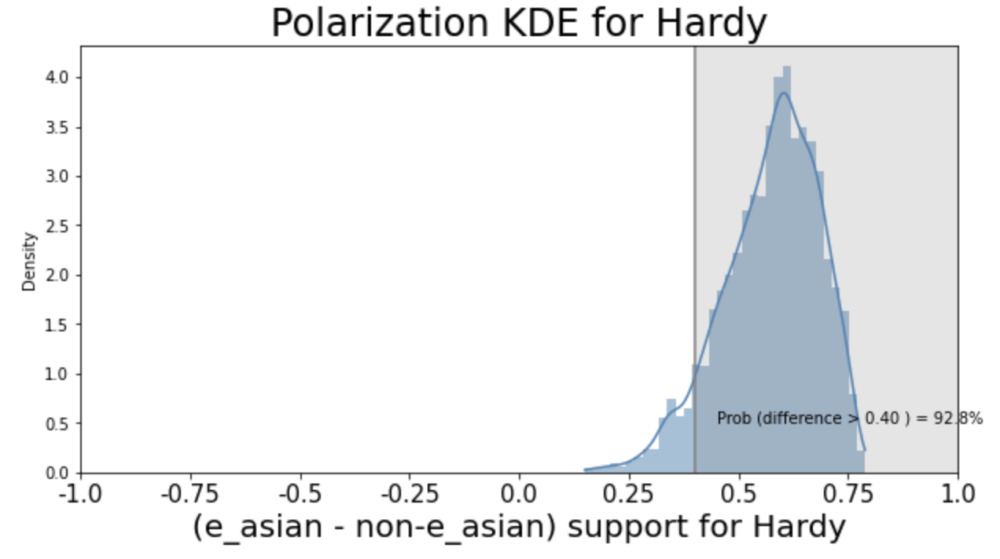

# Summary

An important question in some US voting rights cases and
redistricting litigation is whether and to what degree voting is racially polarized.
In the setting of voting rights cases, ecological inference involves using
observed data about voting outcomes in each of a number of precincts and demographic information
about each precint to infer voting patterns within each demographic group.

More generally, we can think of ecological inference as seeking to use knowledge about the margins of a set of tables (\autoref{fig:table_ex}) to infer associations between the row and column variables, by making (typically probablistic) assumptions about the underlying associations. In the setting of assessing racially polarized voting, each column in a table like the one in \autoref{fig:table_ex} corresponds to a candidate or voting outcome, each row to a racial group, and each table to a precinct. Ecological inference methods then use the known counts of voting outcomes in each precinct and the known counts of people in demographic groups in each precinct to make inferences about the distribution of voting outcomes within each demographic group, thus addressing questions like: "What percentage of voters in Group 1 voted for candidate A?"). The "two by two" ecological inference problem in this example, where we have two groups and two voting outcomes, is a special case of the more general "R by C" ecological inference, in which we may have more than two groups or voting outcomes.
Ecological inference is also applicable in other fields, such as epidemiology and sociology.

{ width=70% }

# Statement of need

The results of ecological inference for inferring racially polarized voting are used in
US voting rights cases; therefore, easy to use and high quality tools for performing ecological inference are of practical interest. There is a need for an ecological inference library that 
brings together a variety of ecological inference methods in one place and makes easy
crucial tasks such as: quantifying the uncertainty associated with ecological inference
results under a given model; making comparisons between methods; and bringing relevant 
diagnostic tools to bear on ecological inference methods. To address this need, 
we introduce `PyEI`, a Python package for ecological inference. 

`PyEI` is meant to be useful to two main groups of researchers. First, it serves application-oriented researchers and practitioners who seek to run ecological inference on domain data (e.g. voting data), report results, and understand the uncertainty related to those results.
Second, it facilitates exploration and benchmarking for researchers who are seeking to understand properties of existing
ecological inference methods in different settings and/or develop new statistical methods for ecological inference.

`PyEI` brings together the following ecological inference methods in a common framework alongside plotting, reporting, and diagnostic tools:

- Goodman's ecological regression [@goodman1953ecological] and a Bayesian linear regression variant [is there a citation? I'm sure people have done this before...]
- The truncated-normal based method of [@king1997solution] NOT YET IMPLEMENTED
- Binomial-Beta hierarchical models [@king1999binomial]
- Dirichlet-Multinomial hierarchical models [@rosen2001bayesian]
- A Bayesian hierarchical method for 2x2 EI following the approach of @wakefield2004ecological
- A Bayesian hierarchical method for RxC EI following the approach of @greiner2009r NOT YET IMPLEMENTED

Several R libraries for ecological inference exist, such as `ei` [@ei], `eiCompare` [@eiCompare], `eiPack` [@eiPack], and `RxCEcolInf` [@RxCEcolInf]. `PyEI` presents a Python-based option that researchers who primarily use Python may appreciate. It also seeks to address some limitations of the existing R libraries, namely that:

- different ecological inference methods are spread out across different libraries
- existing implementations may use slower-to-converge MCMC approaches (BENCHMARK)
- existing libraries do not all expose samples directly (CHECK THAT THIS IS STILL THE CASE) and do not incorporate convergence-related checks and warnings
- not all libraries are oriented towards careful uncertainty quantification (CHECK AND EXPLAIN/SAY THIS MORE CAREFULLY)

\textcolor{violet}{Notes on R packages}

  - `ei`
    - main function is inplementation of King's EI (truncated normal~1997)... functionality is mainly oriented toward 2x2.  Does include RxC generalization and Goodman ER
    - Can get samples of psi, aggregated betas (at the polity level), and precinct-level betas.  The first two are easily grabed by eiread() function.  the latter doesn't seem to be designed to be grabbed, but the samples can be read.
    - convergence testing/diagnostics are not transparent (if they are done at all)... there is a 'resamp' parameter that appears to be some sort of diagnostic, but I'm not sure what it is exactly (not explained much in documentation)
    - standard errors and 80% "confidence intervals" (these appear to be just .1 and .9 percentiles of sample) for precinct-level betas.  Also gives standard errors for psis and aggregate betas.
  - `eiPack`
    - includes multinomial dirichlet (ala Rosen), Goodman ER, ER w/ Bayesian normal regression, and some plotting functionality (density and bounds)
    - outputs draws for alphas, betas, and cell counts as well as acceptance ratios of these variable draws
    - no convergence tests/diagnostics included or described.  Presumably the outputs can make use of the functionality of the coda package to perform these, but user would have to write this script.
    - Has plotting functionality for unit (precinct)-level credible intervals, though this appears to be just for visualization and less for actually grabbing/using these values... no functionality/attention to uncertainty for other measures of interest
  - `eiCompare`
    - Appears to be primarily a wrapper around `ei` and `eiPack` packages.  Some added funcationality (including capturing uncertainty, visualization, and comparison of results across methods).  Some instances appear to be literally rewritten from these packages with minor/trivial tweaks, rather than significantly different implementations.
  - `RxCEcolInf`
    - package really just includes the model from the 2009 Greiner/Quinn paper
    - outputs draws for: internal cell counts, thetas, mu, and the standard deviations and correlations in sigma.
    - convergence tests not directly incorporated, but returns mcmc object with intention of using functionality of R's coda package.  Documentation examples show using coda's Geweke's as well as Heidelberger and Welch's convergence diagnostics, but ackwledges that chains created by `RxCEcolInf` will cause error in coda's Gelman-Rubin diagnostic.
    - the `RxCEcolInf` package itself does not include careful uncertainty quantification functionality, but digging through some of their replication code from their paper does show some examples of uncertainty calculations and credible intervals, though not particularly well documented/clear how to apply

To meet the needs described here, `PyEI` incorporates the following key features and characteristics. First, the Bayesian hierarchical methods implemented in `PyEI` rest on modern probabilistic programming tooling [@salvatier2016probabilistic] and MCMC methods [@hoffman2014no]. Integration with existing tools `PyMC` [@salvatier2016probabilistic] and ArViZ [@arviz_2019] makes the results amenable to state of the art diagnostics (e.g. convergence diagostics) and some reasonable checks are automatically performed. Second, summary and plotting utilities for reporting, visualizing, and comparing results are included (see example plots below), with an emphasis on visualizations and reports that make clear the uncertainty of estimates under a model. Lastly, clear documentation and examples are provided.

# Examples of plotting functionality

{ width=60% } 

{ width=70% }

{ width=70% }

{ width=60% }

{ width=40% }

# Acknowledgements

We acknowledge contributions from ...

# References

